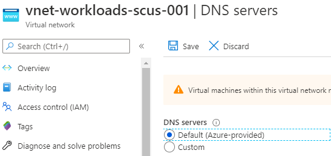
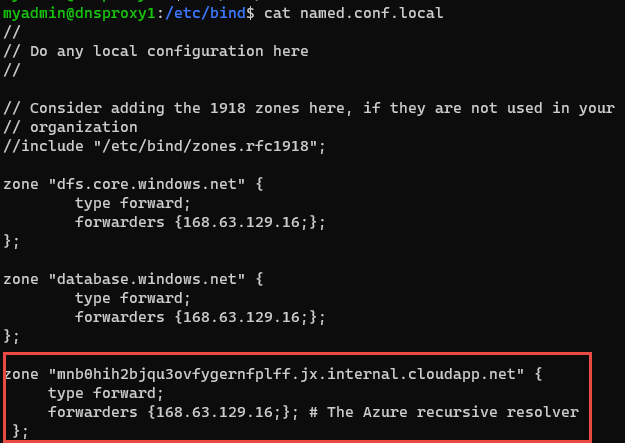
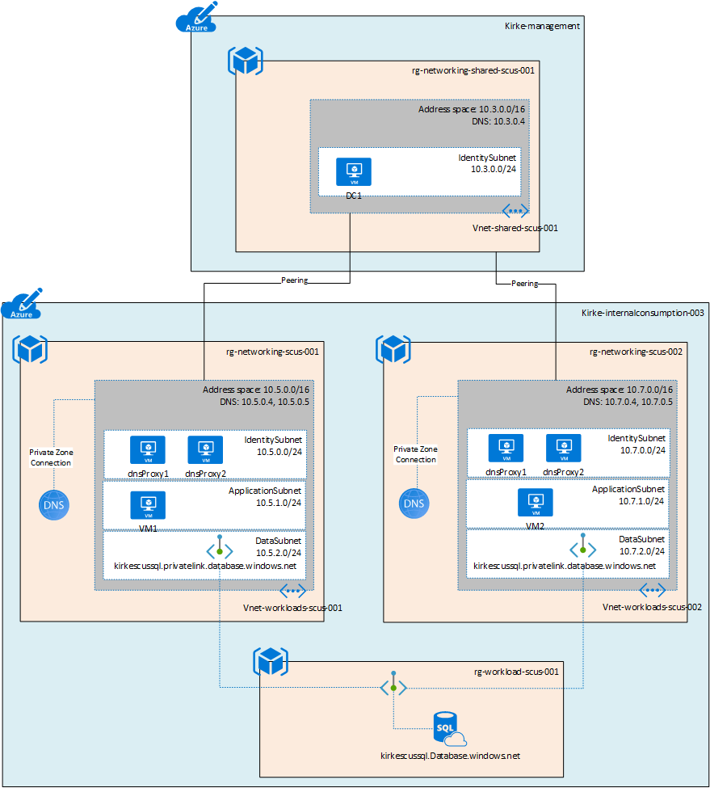
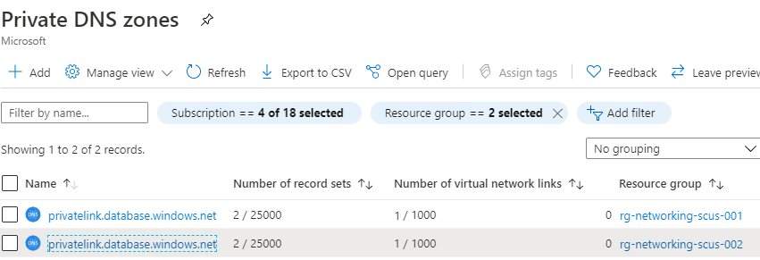
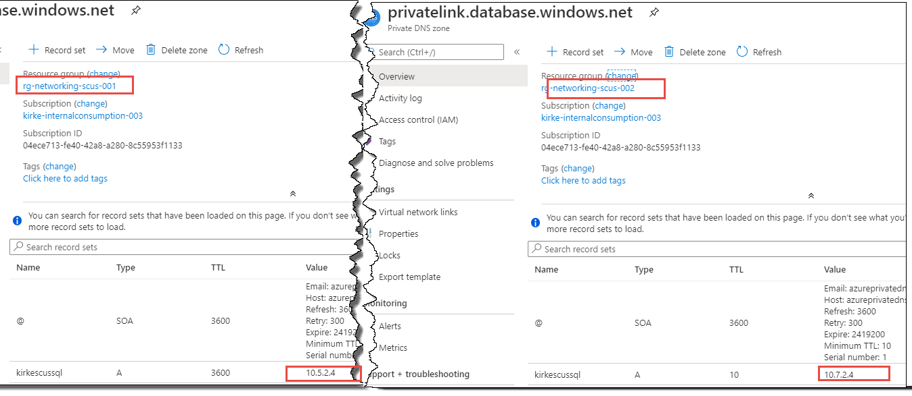
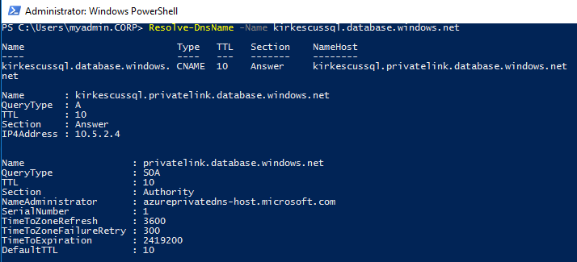
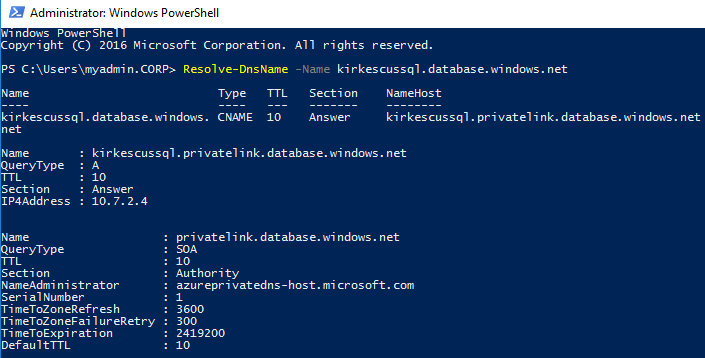
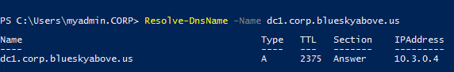
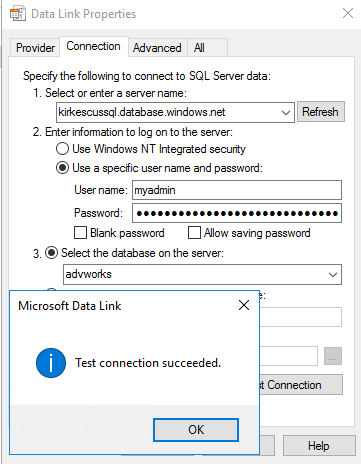

# DNS Forwarder VM

This sample shows how to create a custom DNS server in an Azure virtual network that enables multiple spoke virtual networks in a hub and spoke architecture to reference the same private endpoint. 

This sample is based on the document [Connect HDInsight to your on-premises network](https://docs.microsoft.com/en-us/azure/hdinsight/connect-on-premises-network). 

## Problem statement

In a hub and spoke architecture where the hub VNet contains the DNS server, each spoke VNet must use a private DNS zone to reference the private endpoint. Each Azure Private DNS Zone requires a connection to the virtual network that references it. This works well if the private DNS zone is only used by the spoke and both the hub VNet and spoke VNet can connect to the Azure Private DNS Zone. 

However, if two spoke VNets need to reference the same private endpoint, there would be two separate Azure Private DNS Zones for that endpoint. 

One solution is to put the private endpoint in the hub network, and each spoke VNet connects to the Azure Private DNS Zone. If this solution does not meet your requirements, then the next option is to leverage a DNS forwarder in each of the spoke VNets. 

## Pre-requisites

This demo only deploys the custom DNS servers. You must have an existing virtual network and subnet to add the VM's NIC to. 

The virtual network must use the default Azure-provided DNS and not use a custom DNS server. 



This is because the `forwarderSetup.sh` script adds the virtual network's DNS suffix as a zone within the custom DNS server in the `named.conf.local` configuration file using the following code:

````bash
azurednssuffix=$(hostname -f | cut -d "." -f2-)
````

This value can only be obtained when the virtual network is configured to use the Azure-provided DNS. The result will look similar to the following:



## Solution

This solution uses [Bind DNS software](https://www.isc.org/downloads/bind/) to act as a DNS forwarder. For queries to database.windows.net, the DNS forwarder will forward the query to the Azure Recursive Resolver at `168.63.129.16`. For all other queries, it will forward to the DNS server specified in the `named.conf.options` configuration file, in this sample that is the DNS server in the hub VNet. 

An ACL is placed on the DNS server so that only the spoke VNet is able to communicate to the DNS server. 



For more information on name resolution for Azure, see [Name resolution using your own DNS server](https://azure.microsoft.com/documentation/articles/virtual-networks-name-resolution-for-vms-and-role-instances/#name-resolution-using-your-own-dns-server).

For more information, see Daniel Mauser's excellent repository on [Private Link Integration Scenarios](https://github.com/dmauser/PrivateLink/tree/master/DNS-Integration-Scenarios). 


## Deploying the demo

The demo can be deployed using the `deploy.sh` script. This script will upload a script to an Azure Storage account and generate a SAS URL for it that is used for the Linux custom script extension. It then deploys the ARM template using the parameters file and the SAS URL of the script. 

### Modify the script
To use this script, first modify the variables at the top of the file.

````bash
rg="rg-networking-scus-002"
storage="stdeployarm"
storageResourceGroup="rg-workloadmanagement-scus-001"
container="deploy"
````
| Variable | Description |
| :------- | :---------- |
| rg       | Name of the resource group where the VMs will be deployed to |
| storage  | Name of the storage account where the script will be uploaded |
| storageResourceGroup | Resource group name that contains the storage account |
| container | The name of the container in the storage account where the script is uploaded |

### Modify the parameters file
The deployment template has a parameters file that also must be updated.

| Parameter | Description |
| :------- | :---------- |
| adminUserName       | Name of the administrative user |
| vNetResourceGroup  | The resource group containing the existing virtual network where the DNS servers will be deployed to |
| vNetName | Name of the existing virtual network where the DNS servers will be deployed to |
| vnetAddressPrefix | Address prefix of the existing virtual network where the DNS servers will be deployed to |
| subnetName | Name of the existing subnet in the the existing virtual network where the DNS servers will be deployed to |
| forwardIP | IP address to forward DNS queries to. For this sample, this is the DNS server in the hub virtual network. |
| adminPublicKey | SSH public key used to authenticate. Don't use passwords. In this example, an Azure Key Vault is used to store the credentials. For more information, see [Tutorial: Integrate Azure Key Vault in your ARM template deployment](https://docs.microsoft.com/en-us/azure/azure-resource-manager/templates/template-tutorial-use-key-vault) |
| scriptURL | The SAS URL of the script used by the custom script extension. This URL is created in the `deploy.sh` script. 

### Demo results

To understand what's happening, it is highly recommended to review Daniel Mauser's excellent work on [Private Link DNS Integration Scenarios](https://github.com/dmauser/PrivateLink/tree/master/DNS-Integration-Scenarios). 

Given the sample architecture:


An Azure SQL Database is created with the logical server name `kirkescussql.database.windows.net`. Each VNet then has a private endpoint with a different IP. This creates two different Azure Private DNS Zones. 



You can see that each private DNS zone created differs only by the IP address.



Logging into VM1 in the first spoke VNet, we can demonstrate that the name resolves to the correct IP.



Logging into VM2 in the second spoke VNet, we can demonstrate that the name resolves to the same service but with the correct IP.



The real test, of course, is making sure that the VM can still contact the domain controller. Yes, we can see that our DNS server answered the query. 



Finally, can we talk to the database? A simple test is to create a text file and then rename the extension as .UDL. Then open it to use the ODBC connection tool to test the connection. 

